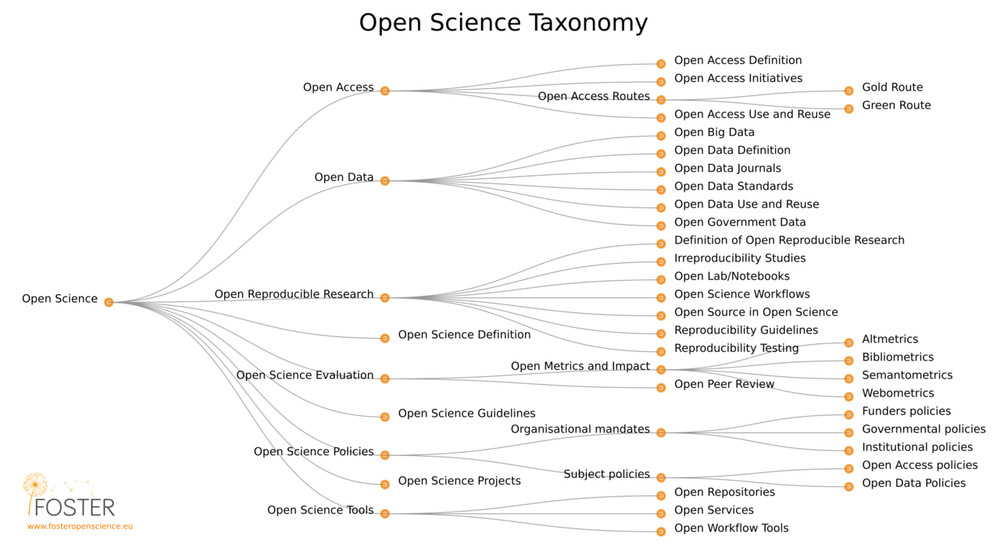

```{r setup, include=FALSE}
knitr::opts_chunk$set(echo = TRUE, 
                      message = FALSE,	
                      warning = FALSE,
                      fig.width = 4, 
                      fig.height = 4, 
                      fig.retina = 3)
options(htmltools.dir.version = FALSE)
```

```{r style-share-again, echo=FALSE}
xaringanExtra::use_share_again()
xaringanExtra::style_share_again(
  share_buttons = "all")
xaringanExtra::use_clipboard()
xaringanExtra::use_extra_styles(
  hover_code_line = TRUE,         
  mute_unhighlighted_code = TRUE)
```

```{r packages, include=FALSE}
library(RefManageR)
library(kableExtra)
library(tidyverse)
library(googlesheets4)
library(showtext)
```


```{r, load-refs, include=FALSE, cache=FALSE}
BibOptions(check.entries = FALSE,
           bib.style = "authoryear",
           cite.style = "authoryear",
           style = "markdown",
           hyperlink = TRUE,
           dashed = FALSE,
           longnamesfirst = FALSE,
           max.names = 2)
myBib <- ReadBib("../refs.bib", check = FALSE)
```

```{r fonts, include=FALSE}
font_add_google("Gochi Hand", "Gochi Hand")
showtext_auto()
```

<style>
div.blue { background-color:#b0cdef; border-radius: 5px; padding: 20px;}
div.grey { background-color:#d3d3d3; border-radius: 0px; padding: 0px;}
</style>

# Overview

* Aims and learning objectives of 58M
* Pre-module survey results!
* What is Data Science?
  * definition and process
  * reproducibility
  * a rationale for scripting
* Module overview
  * topic list and rationale
  * approach and assessment 
  * relationship between topics and assessment

---
# Aims & Learning Outcomes

The aim of 58M *overall* is to enable you to to develop skills in some specific types of ‘data analysis’ by providing supported practice in workshops and opportunities to apply them independently in ‘projects’. This will help you become independent researchers and highly employable.

--

At the end of this module the successful student will be able to:
1. Demonstrate the acquisition of skills in experimental design and data analysis, related to the option chosen within the module.
2. Apply the skills learned to address novel bioscience problems.

---
# Learning Outcomes of Data Science

For Data Science, the first objective means:

Produce a reproducible data analysis and report. The analysis can emphasise data import, processing, statistical analysis, visualisation or any combination of these.

---
# Survey results 1/3

```{r echo=FALSE}
# gs4_auth() run interactively
file <- "https://docs.google.com/spreadsheets/d/10t1gewbugw45l39WzFk6B_hHdI8o6R7G5MHO50yBCio/edit#gid=495644289"
survey <- read_sheet(file)

```
The distribution of ratings you (n = `r dim(survey)[1]`) gave in the survey were:
```{r echo=FALSE, fig.width = 8, fig.height=7}

rateqs_orig <- c("Rate your level of experience with R relative to your peers. Consider 3 to be about average, for someone who has had R teaching in stages 1 and 2 and used it for data analysis in other modules.",
            "Rate your comfort and enthusiasm for data analysis in general relative to your peers",
            "Rate your comfort or enthusiasm for computing environments relative to your peers")
rateqs <- c("Experience with R",
            "Comfort or enthusiasm for data analysis",
            "Comfort or enthusiasm for computing environments")

anno <- data.frame(Question = rateqs, x = .75, y = 20)
survey %>%
   select(rateqs_orig) %>% 
   rename_at(vars(rateqs_orig), ~ rateqs) %>% 
   pivot_longer(names_to = "Question",
                values_to = "Rating",
                cols = everything()) %>% 
   ggplot(aes(x = factor(Rating))) +
   geom_bar(fill = "#9d5e78") +
   scale_x_discrete(name = "Rating") +
   scale_y_continuous(name = "Number of people",
                      expand = c(0, 0),
                      breaks = c(0, 5, 10, 15, 20, 25),
                      limits = c(0, 30)) +
   geom_text(data = anno, 
             aes(x = x, y = y, label = Question),
             hjust = 0, 
             family = "Gochi Hand",
             colour = "#25496b",
             size = 18) +
   facet_wrap(.~ Question, nrow = 3,  strip.position = "right") +
   theme_classic() +
   theme(axis.title = element_text(size = 55),
         axis.text = element_text(size = 35),
         strip.text = element_blank(),
         plot.background = element_rect(fill = "#f6fafd"),
         panel.background = element_rect(fill = "#f6fafd"))


```
---
# Survey results 2/3

Please rate your level of comfort with...

```{r echo=FALSE, fig.width = 12, fig.height=7}

topics <- survey %>%
   select(starts_with("Please rate your level of comfort with the following in R")) %>%
   data.frame(.,check.names = FALSE)

names(topics) <- names(topics) %>%
  sub(pattern = "Please rate your level of comfort with the following in R \\[*",
      replacement = "") %>%
  sub(pattern = "\\]", replacement = "")
my_levels <- c("I don't understand what this involves",
               "I would recognise this but don't really use it",
               "I've used a bit but am not comfortable with it",
               "Fairly comfortable in some aspects",
               "Comfortable most of the time",
               "Confident")


topics1 <- topics %>% 
   select(1:8) %>% 
   pivot_longer(names_to = "Topic",
                values_to = "Rating",
                cols = everything())
topics1$Rating <- factor(topics1$Rating, levels = my_levels)

topics1 %>% 
   ggplot(aes(x = Rating)) +
   geom_bar(fill = "#9d5e78") +
   scale_x_discrete(name = "") +
   scale_y_continuous(name = "Number of people",
                      expand = c(0, 0),
                      breaks = c(0, 5, 10, 15, 20, 25, 30, 35),
                      limits = c(0, 37)) +
    facet_wrap(.~ Topic, nrow = 3,  strip.position = "top",
              labeller = label_wrap_gen(width = 38)) + 
   coord_flip() +
   theme_classic() +
   theme(axis.title = element_text(size = 25),
         axis.text.x = element_text(size = 25),
         axis.text.y = element_text(size = 25),
         strip.text.x = element_text(size = 25, lineheight = 0.5,
                                     margin = margin(b = 0)),
         strip.background = element_rect(fill = "#f6fafd", colour = "#f6fafd"),
         plot.background = element_rect(fill = "#f6fafd"),
         panel.background = element_rect(fill = "#f6fafd"))
```
---
# Survey results 3/3

Please rate your level of comfort with...

```{r echo=FALSE, fig.width = 12, fig.height=7}
topics2 <- topics %>% 
   select(9:17) %>% 
   pivot_longer(names_to = "Topic",
                values_to = "Rating",
                cols = everything())
topics2$Rating <- factor(topics2$Rating, levels = my_levels)

topics2 %>% 
   ggplot(aes(x = Rating)) +
   geom_bar(fill = "#9d5e78") +
   scale_x_discrete(name = "") +
   scale_y_continuous(name = "Number of people",
                      expand = c(0, 0),
                      breaks = c(0, 5, 10, 15, 20, 25, 30, 35),
                      limits = c(0, 37)) +
   facet_wrap(.~ Topic, nrow = 3,  strip.position = "top",
              labeller = label_wrap_gen(width = 38)) + 
   coord_flip() +
   theme_classic() +
   theme(axis.title = element_text(size = 25),
         axis.text.x = element_text(size = 25),
         axis.text.y = element_text(size = 25),
         strip.text.x = element_text(size = 25, lineheight = 0.5,
                                     margin = margin(b = 0)),
         strip.background = element_rect(fill = "#f6fafd", colour = "#f6fafd"),
         plot.background = element_rect(fill = "#f6fafd"),
         panel.background = element_rect(fill = "#f6fafd"))
```
---
# What is Data Science?

The development, and application, of reproducible workflows for the simulation, collection, organisation, processing, analysis and presentation of data in order to extract knowledge or insight.

Data science underlies open and reproducible research.

## How much of data science is using statistics?

Less than you probably think

~80% of your time on getting data, cleaning data, aggregating data, reshaping data, and exploring data using exploratory data analysis and data visualization.


---
# Reproducibility is key!

One definition
*"... obtaining consistent results using the same input data; computational steps, methods, and code; and conditions of analysis. This definition is synonymous with “computational reproducibility"*. `r Cite(myBib, "National_Academies_of_Sciences_Engineering2019-sb")`

Also see National Science Foundation `r Cite(myBib, "K_Bollen2015-un")`


---
# Who cares?

* Many high profile cases of work which did not reproduce e.g. Anil Potti unravelled by `r Citet(myBib, "Baggerly2009-pw")` 

* Five selfish reasons to work reproducibly `r Cite(myBib, "Markowetz2015")`. Alternatively, see the [talk](https://youtu.be/yVT07Sukv9Q)


* Will become standard in Science and publishing e.g OECD Global Science Forum Building digital workforce capacity and skills for data-intensive science `r Cite(myBib, "OECD_Global_Science_Forum2020-cp")`

---
# Open Science

```{r foster-fig, echo = FALSE}

```
.font60[
By Petr Knoth and Nancy Pontika - https://en.wikipedia.org/wiki/Open_science#/media/File:Os_taxonomy.png, CC BY 3.0, https://commons.wikimedia.org/w/index.php?curid=61125075
]

FAIR - Findable, Accessible, Interoperable, Reusable `r Cite(myBib, "Wilkinson2016-pu")`


---
background-image: url(../pics/rationale1.png)
background-position: 50% 35%
background-size: 600px

# Rationale for scripting analysis
Science is the generation of ideas, designing work to test them and reporting the results.
<br>
<br>
<br>
<br>
<br>
<br>
<br>
<br>
<br>
<br>
.pull-left[
Generating the results
]

.pull-right[
Analysing and reporting them
]
---
background-image: url(../pics/rationale2.png)
background-position: 50% 35%
background-size: 600px

# Rationale for scripting analysis
We ensure reproducibility of laboratory and field work by planning and recording in lab books and using standard protocols. 
--
<br>
<br>
<br>
<br>
<br>
<br>
<br>
<br>
<br>
Even so replicating results can be hard.
---
background-image: url(../pics/rationale3.png)
background-position: 50% 35%
background-size: 600px

# Rationale for scripting analysis
We ensure reproducibility of laboratory and field work by planning and recording in lab books and using standard protocols. 
<br>
<br>
<br>
<br>
<br>
<br>
<br>
<br>
<br>
Even so replicating results can be hard.

Workflows for computational projects and the data analysis and reporting of other work can, and should, be 100% reproducible! Scripting is the way to achieve this.

---
background-image: url(../pics/rationale5.png)
background-position: 80% 35%
background-size: 800px

# Rationale for scripting analysis

That reproducibility applies to all aspects of the data workflow.
<br>
<br>
<br>
<br>
<br>
<br>
<br>
<br>
<br>
--
From importing or collecting the data, processing it for analysis, building statistical models and communicating the methods and results.

--

These are usually iterative and that process of iteration (the development of the analysis) should also be captured.
---
# Why R?

Open source and free

--
 .......But so is Python
  
--

R has reputation for catering to users who do not see themselves as programmers, and  allowing them to slide gradually into programming.


--

It was also designed for data analysis and graphics - it is a 'domain specific' programming language - which means it is usually easier to achieve those tasks in R than a general purpose programming language.

---
background-image: url(../pics/welcome_to_rstats_twitter.png)
background-position: 95% 75%
background-size: 350px
# Why R?

The R community is one of R's greatest assets, being vibrant, inclusive and supportive of users at all levels.

* [#rstats](https://twitter.com/hashtag/rstats?lang=en) on twitter is very active
* [RForwards](https://forwards.github.io/about/) the widening participation task force <sup>1</sup>
* [RLadies](https://rladies.org/) gender diversity promotion 
* [Hey! You there! You are welcome here](https://ropensci.org/blog/2017/06/23/community/)  

.font70[
.footnote[
Artwork by @allison_horst "welcome to rstats on twitter"
1. I am member of the Core Team for Forwards
]
]

---
background-image: url(../pics/rmarkdown_wizards.png)
background-position: 10% 50%
background-size: 500px
# Why R?

R Markdown is sometimes called R's "killer feature". It turns your analyses into fully reproducible high quality documents, reports, presentations and dashboards.

.font70[
.footnote[
Artwork by @allison_horst "Be an Rmarkdown knitting wizard."
]
]

---
# Module overview

Chosen topics are: foundational, follow stages 1 and 2 well, are widely applicable (in this module and beyond) and transferable conceptually:

* Using RStudio projects and an emphasis on good practice in code and project documentation and organisation including version control and collaboration.
* More advanced data tidying.
* An emphasis on reproducibility and reproducible reporting using R Markdown.
* Some machine learning concepts and methods that are very commonly applied independent of the data domain.

You will also have the time and opportunity to independently develop skills particular to your interests and the assessment undertaken with support.

---
# Week plan 
.font80[
* Week 2: Preparation 1 - Update your R and RStudio, revise previously taught material.
* Week 3: Preparation 2 - Introduction to the module. Installing git and getting a GitHub account.
* Week 4: Topic 1 - Project organisation. Tools for version control and collaborating. *
* Week 5: Topic 2 - Tidying data and the tidyverse.*
* Week 6: Topic 3 - Reproducibility and an introduction to R Markdown.*
* Week 7: Topic 4 - Advanced R Markdown.*
* Week 8: Topic 5 - An introduction to Machine Learning: Overview and Unsupervised methods.*
* Week 9: Topic 6 - An introduction to Machine Learning: Supervised Methods.*
* Week 10: Project consultation. *
* Spring Weeks 1 - 5: Project work. Drop-ins TBC

\* week includes a timetabled online session
]

---
# Approach and Assessment

I wanted you to
* learn essential skills for reproducible and open research but otherwise..
* be able to work on problems you are interested in and/or that are related to project or module work
* have time to develop the skills for that, with support
* be assessed on what you can do (not what you can't do)

Thus there is choice and flexibility in the assessment. You can chose your own data set and problem. Two highly scoring submissions could look completely different.

---
# The options

1. Reproducible analysis related to your project/module work
   * Analysis of existing or simulated data including images
   * Conversion of existing lab tools (eg excel files) to reproducible pipelines
   * Analysis of literature (text analysis)
2. Reproducible analysis of previous work undertaken unreproducibly
   * 58I Bioscience Techniques - almost all of the analyses undertaken (use of excel, Summit, ImageJ etc) can be coded reproducibly.
3. Reproducible analysis of a provided project - because not everyone enjoys choosing their own

---
# Topics and assessment
.font70[
* <div class = "blue">Week 4: Topic 1 - Project organisation.</div> Tools for version control and collaborating. 
* Week 5: Topic 2 - Tidying data and the tidyverse.
* <div class = "blue">Week 6: Topic 3 - Reproducibility and an introduction to R Markdown.</div>
* <div class = "blue">Week 7: Topic 4 - Advanced R Markdown.</div>
* Week 8: Topic 5 - An introduction to Machine Learning: Overview and Unsupervised methods.
* Week 9: Topic 6 - An introduction to Machine Learning: Supervised Methods.
]
In your assessment you **must** use RStudio projects and rmarkdown, organise your analyses for reproducibility and follow good practice.

---
# Topics and assessment
.font70[
* <div class = "blue">Week 4: Topic 1 - Project organisation.</div> Tools for version control and collaborating. 
* Week 5: Topic 2 - Tidying data and the tidyverse.
* <div class = "blue">Week 6: Topic 3 - Reproducibility and an introduction to R Markdown.</div>
* <div class = "blue">Week 7: Topic 4 - Advanced R Markdown.</div>
* Week 8: Topic 5 - An introduction to Machine Learning: Overview and Unsupervised methods.
* Week 9: Topic 6 - An introduction to Machine Learning: Supervised Methods.
]

The extent of data tidying and processing and machine learning methods will vary depending on your project. 

Version control is not required - it's taught only to help you collaborate online.

---
# Topics and assessment
.font70[
* <div class = "blue">Week 4: Topic 1 - Project organisation.</div> Tools for version control and collaborating. 
* Week 5: Topic 2 - Tidying data and the tidyverse.
* <div class = "blue">Week 6: Topic 3 - Reproducibility and an introduction to R Markdown.</div>
* <div class = "blue">Week 7: Topic 4 - Advanced R Markdown.</div>
* Week 8: Topic 5 - An introduction to Machine Learning: Overview and Unsupervised methods.
* Week 9: Topic 6 - An introduction to Machine Learning: Supervised Methods.
]

You can learn something completely different as long as your work is reproducible and uses an [RMarkdown format](https://rmarkdown.rstudio.com/). This includes shiny applications.

---
# Assessment

Everyone will have the opportunity for a one-to-one meeting to discuss the remit and scoping of their project during the Autumn term. [Book 58M Project one-to-one](https://calendar.google.com/calendar/selfsched?sstoken=UUQxaU5lQ1V5RXNUfGRlZmF1bHR8OGY2NDQzZmVjMDQyODc3ZGY5OTdkYzQzZWFlYWFmNjU)

Everyone will have the opportunity for a one-to-one meeting for formative feedback on their project during the Spring term.

---
# Questions

You can ask any questions about taught materials or the assessment in the Blackboard Collaborate workshop chat. 

You can also ask any questions [here](https://docs.google.com/document/d/1MgGCLlStDq_MSNmroyVkbrJCMjs9wuQViPQ2z8U5VXA/edit#heading=h.sicwyys1xx47) 

<div class="tenor-gif-embed" data-postid="11365139" data-share-method="host" data-width="50%" data-aspect-ratio="1.4310344827586208"><a href="https://tenor.com/view/hadley-wickham-rstats-typing-rcode-gif-11365139">Hadley Wickham GIF</a> from <a href="https://tenor.com/search/hadley-gifs">Hadley GIFs</a></div><script type="text/javascript" async src="https://tenor.com/embed.js"></script>
---
# References

```{r refs1, echo=FALSE, results="asis"}
PrintBibliography(myBib,start = 1, end = 4)
```

---
# References
.footnote[
Slides made with with xaringan `r Cite(myBib, "xaringan")` and xaringanExtra `r Cite(myBib, "xaringanExtra")`
]

```{r refs2, echo=FALSE, results="asis"}
PrintBibliography(myBib, start = 6)
```

---
# Organisations

* [The Alan Turing Institute](https://www.turing.ac.uk/)  
* [Software Sustainability Institute](https://www.software.ac.uk/)  
* [UK Reproducibility Network](https://www.ukrn.org/)  
* [FOSTER Plus](https://www.fosteropenscience.eu/)  
* [Center for Open Science](https://www.cos.io/)  
---

## Emma Rand <br> [emma.rand@york.ac.uk](mailto:emma.rand@york.ac.uk) <br> Twitter: [@er13_r](https://twitter.com/er13_r) <br> GitHub: [3mmaRand](https://github.com/3mmaRand)  <br> blog: https://buzzrbeeline.blog/
<br>
<a rel="license" href="http://creativecommons.org/licenses/by-nc-sa/4.0/"></a><br /><span xmlns:dct="http://purl.org/dc/terms/" property="dct:title">Data Science strand of BIO00058M</span> by <span xmlns:cc="http://creativecommons.org/ns#" property="cc:attributionName">Emma Rand</span> is licensed under a <a rel="license" href="http://creativecommons.org/licenses/by-nc-sa/4.0/">Creative Commons Attribution-NonCommercial-ShareAlike 4.0 International License</a>.


