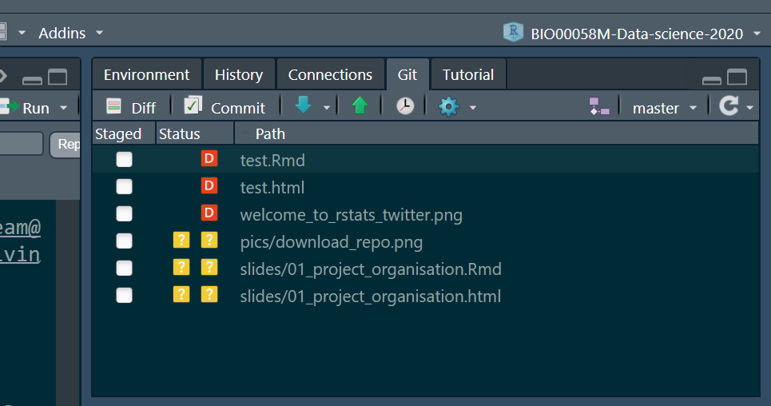
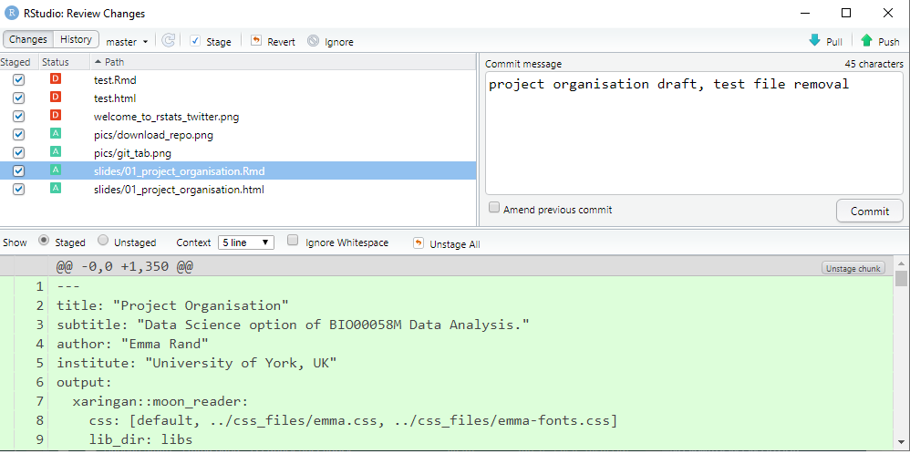
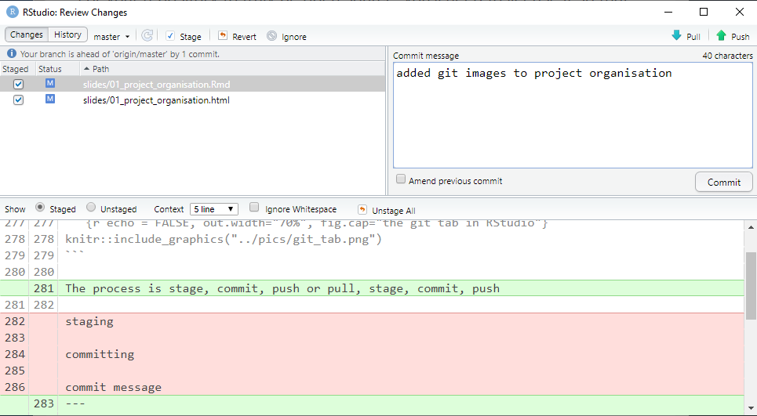

```{r setup, include=FALSE}
knitr::opts_chunk$set(echo = TRUE, 
                      message = FALSE,	
                      warning = FALSE,
                      fig.width = 4, 
                      fig.height = 4, 
                      fig.retina = 3)
options(htmltools.dir.version = FALSE)
```

```{r style-share-again, echo=FALSE}
xaringanExtra::use_share_again()
xaringanExtra::style_share_again(
  share_buttons = "all")
xaringanExtra::use_clipboard()
xaringanExtra::use_extra_styles(
  hover_code_line = TRUE,         
  mute_unhighlighted_code = TRUE)
```

```{r packages, include=FALSE}
library(RefManageR)
library(kableExtra)
library(tidyverse)
```


```{r, load-refs, include=FALSE, cache=FALSE}
BibOptions(check.entries = FALSE,
           bib.style = "authoryear",
           cite.style = "authoryear",
           style = "markdown",
           hyperlink = TRUE,
           dashed = FALSE,
           longnamesfirst = FALSE,
           max.names = 2)
myBib <- ReadBib("../refs.bib", check = FALSE)
```

<style>
div.blue { background-color:#b0cdef; border-radius: 5px; padding: 20px;}
div.grey { background-color:#d3d3d3; border-radius: 0px; padding: 0px;}
</style>

# Outline

This slide show introduces a workflow for project organisation using RStudio Projects.

It covers structured directories, naming conventions, READMEs, Licenses and version control.

---
class: inverse

# What is a project?

---
# What is a project?

A project is a discrete piece of work which has a number of files associated with it such as the data and scripts for an analysis and the production reports.

--

One science project might have several organisational projects associated with it, for example:

* data files and metadata (which may be made into a package)  
* analysis and reporting  
* a package developed for the analysis
* an app for allowing data to be explored by others

---
# Organising a project

* Use an RStudio Project or similar (most IDEs have them)  
* Use directory structure 
* Have naming conventions   
* Document
  * README
  * License
  * Comprehensive commenting
* Use version control  

---
class: inverse

# RStudio Projects

---
# RStudio Projects

Project is obviously a commonly used word. When I am referring to an [RStudio Project](https://support.rstudio.com/hc/en-us/articles/200526207-Using-Projects) I will use the capitalised words 'RStudio Project' or 'Project'.

In other cases, I will use 'project'.

An RStudio Project is a directory with an .Rproj file in it. 

The name of the RStudio Project is the same as the name of the top level directory which is referred to as the Project directory.

---
# RStudio Projects

For example, if you create an RStudio Project `stem_cell_rna` your folder structure would look something like this:

.pull-left[
```
-- stem_cell_rna
   |__stem_cell_rna.Rproj
   |__raw_ data
      |__2019-03-21_donor_1.csv
   |__functions
      |__01_file_import
      |__02_normalise.R
   |__README.md
   |__analyses
      |__01_data_processing.R
      |__02_exploratory.R
 
```
]


---
# RStudio Projects

.pull-left[
```
*-- stem_cell_rna
   |__stem_cell_rna.Rproj
   |__raw_ data
      |__2019-03-21_donor_1.csv
   |__functions
      |__01_file_import
      |__02_normalise.R
   |__README.md
   |__analyses
      |__01_data_processing.R
      |__02_exploratory.R
 
```
]

.pull-right[
the Project directory
]
---
# RStudio Projects
.pull-left[
```
-- stem_cell_rna
*  |__stem_cell_rna.Rproj
   |__raw_ data
      |__2019-03-21_donor_1.csv
   |__functions
      |__01_file_import
      |__02_normalise.R
   |__README.md
   |__analyses
      |__01_data_processing.R
      |__02_exploratory.R
 
```
]

.pull-right[
  
the .RProj file which is the defining feature of an RStudio Project
]

---
# RStudio Projects

When you open an RStudio Project, the working directory is set to the Project directory (i.e., the location of the .Rproj file).  

When you use an RStudio Project you do not need to use `setwd()`

--

.font150[
`r emo::ji("exploding_head")`
]

--

And your whole project is portable!


--

When someone, including future you, opens the project on another machine, all the paths just work.

.font150[
`r emo::ji("party")`
]
---
class: inverse

# Directory structure

---
# Directory structure

You are aiming for structured , systematic and repeatable. For example, the Project directory might contain:

* .RProj file  
* README - tell people what the project is and how to use it  
* License - tell people what they are allowed to do with your project 
* Directories
  * data-raw/  
  * images/  
  * scripts/  
  * functions/  
  * figures/  

---
# README

READMEs are a form of documentation which have been widely used for a long time. They contain all the information about the other files in a directory. They can be extensive.

* Wikipedia [README page](https://en.wikipedia.org/wiki/README)  
* GitHub Doc's [About READMEs
](https://docs.github.com/en/free-pro-team@latest/github/creating-cloning-and-archiving-repositories/about-readmes)  

---
# README

For *this* module assessment you need only have:

* Title 
* Description, 50 words or so on what the project is
* Technical Description of the project
  * What software and packages are needed including versions
  * Any instructions needed to run the analysis/use the software
  * Any issues that a user (me!) might face in running the analysis/using the software

The README is part of the 2000 word count
---
# License

A license tells others what they can and can't do with your source code.

[choosealicense.com](https://choosealicense.com/) is a useful explainer.

I typically use:

* [MIT License](https://choosealicense.com/licenses/mit/) for software
* [CC-BY-SA-4.0](https://choosealicense.com/licenses/cc-by-sa-4.0/) for other work
---
class: inverse

# Naming things

---
# Naming things

Guiding principle - names of files and directories should be systematic and readable by humans and machines. Have a convention!

I suggest
  * no spaces in names
  * use snake_case or kebab-case rather than CamelCase  or dot.case   
  * use all lower case except very occasionally where convention is otherwise, e.g., README, LICENSE
  * ordering: use left-padded numbers e.g., 01, 02....99 or 001, 002....999
  * dates [ISO 8601](https://en.wikipedia.org/wiki/ISO_8601) format: 	2020-10-16
---
# Naming things - example

.code40[
```
-- stem_cell_rna
   |__stem_cell_rna.Rproj
   |__raw_ data
      |__2019-03-21_donor_1.csv
      |__2019-03-21_donor_2.csv
      |__2019-03-21_donor_3.csv
      |__2019-05-14_donor_1.csv
      |__2019-05-14_donor_2.csv
      |__2019-05-14_donor_3.csv
   |__processed_data
      |__all_long.txt
      |__all_wide.txt
   |__figures
      |__01_volcano_donor_1_vs_donor_2.eps
      |__02_volcano_donor_1_vs_donor_3.eps
   |__functions
      |__01_file_import
      |__02_normalise.R
      |__theme_pca.R
      |__theme_volcano.R
   |__pics
      |__01_image.png
      |__01_image.png
   |__README.md
   |__refs
      |__r_refs.bib
      |__proj_refs.bib
   |__analyses
      |__01_data_processing.R
      |__02_exploratory.R
      |__03_modelling.R
      |__04_figures.R
      |__05_report.Rmd
```
]

---
class: inverse

# Version controlled RStudio Project

---
# Version controlled RStudio Project

When you are using an version controlled RStudio Project you will have a Git tab

```{r echo = FALSE, out.width="70%", fig.cap="the git tab in RStudio"}

```

The process is stage, commit, push or pull, stage, commit, push

---
# Version controlled RStudio Project

```{r echo = FALSE, out.width="70%", fig.cap="the review changes window in RStudio showing files that have been added or deleted since the last commit"}

```

Top left is the list of files with changes since the last commit. 4 files have been added [A] and three deleted [D]

Bottom pane shows the 'diffs' - the differences between the current file and the file at the last commit. "slides/01_project_organisation.Rmd" is entirely new so it is all green


---
# Version controlled RStudio Project

```{r echo = FALSE, out.width="70%", fig.cap="the review changes window in RStudio showing files that have been modified since the last commit"}

```

In this example, 2 files have been modified [M] since the last commit.

The "diffs" shows text that has been added (green) or deleted (red).

Each commit is accompanied by a Commit message which concisely summarises the changes you have made.
 

---
class: inverse

# A workflow

---
# A workflow

In this module, we are covering a specific workflow which uses GitHub as remote a remote server.

--

It is the [New project, GitHub first](https://happygitwithr.com/new-github-first.html) workflow from Happy git and GitHub for the useR `r Cite(myBib, "Bryan_Happy_Git")`

--

This workflow is demonstrated in "Project Organisation - demo"

---
# A workflow

The first step is to introduce yourself to git. You only have to do this once.

Start RStudio and with your own name and email do:
```{r eval=FALSE}
usethis::use_git_config(user.name = "Emma Rand",
                        user.email = "emma.rand@york.ac.uk")
```

Name: It can be, but does not have to be, your GitHub username. It will be used to label your commits so make it recognisable for future you and potential collaborators.

Email: has to be the one used for your GitHub account.
 
 
---
# A workflow

The second step is to do the [New project, GitHub first](https://happygitwithr.com/new-github-first.html) workflow. You have to do this each time you start a new version controlled RStudio project with a remote repo.

* Make a new repo on GitHub
  * initialise with a README  and license
  * allow public
* Copy the HTTPS to the clipboard

---
# A workflow

Go to RStudio

* File | New Project choose version control
* Choose where to create the Project directory
* Paste the URL that you copied to the clipboard
* Create Project

RStudio will restart and your working directory will be the Project directory

---
# A workflow
You are now set up.

* Do some work
* Stage and commit changes including a commit message
* Push to GitHub

Better
* Pull
* Do some work
* Stage and commit changes including a commit message
* Pull
* Push to GitHub

---
# What now?

You may be able to create a version controlled RStudio Project with a remote on GitHub from these slides alone but watching the demo is recommended.

--

Do I have to use version control? Not for the assessment, no. It is included to help you work with others in an online workshop and because it is a highly employable skill with a steep learning curve. Starting that process with a limited workflow will help.

If your level of anxiety over git/GitHub is outweighing any possible benefits, **don't use it**.

---
# RStudio projects without version control

An [RStudio project](https://support.rstudio.com/hc/en-us/articles/200526207-Using-Projects) is associated with a directory. 

You create a new project with File | New Project...

---
# RStudio projects without git

When a new project is created RStudio:

1. Creates a project file (with an .Rproj extension) within the project directory.  
2. Creates a hidden directory (named .Rproj.user) where project-specific temporary files are stored.  
3. Loads the project into RStudio and display its name in the Projects toolbar (far right on the menu bar).

Using a Project helps you manage file paths. The working directory is the Project directory (i.e., the location of the .Rproj file).

---
# RStudio projects without git

You can open a project with:

1. File | Open Project or  File | Recent Projects  
2. Double-clicking the .Rproj file  
3. Using the option on the far right of the tool bar  

When you open project, a new R session starts and various settings are restored to their condition when the project was closed.

---
# Reading

## Strongly recommended
* Chapter 2 Project-oriented workflow | What They Forgot to Teach You About R `r Cite(myBib, "Bryan-Hester")`

## Further
* Ten simple rules for reproducible computational research `r Cite(myBib, "Sandve2013-nd")` 
* Good enough practices in scientific computing `r Cite(myBib, "Wilson2017-cp")`  
* Excuse Me, Do You Have a Moment to Talk About Version Control? `r Cite(myBib, "Bryan2018-hl")`  


---
# References
.font60[
.footnote[
Slides made with with xaringan `r Cite(myBib, "xaringan")`,  xaringanExtra `r Cite(myBib, "xaringanExtra")` and `r Cite(myBib, "xaringanthemer")`

]

```{r refs, echo=FALSE, results="asis"}
PrintBibliography(myBib)
```

]


---

Emma Rand <br> [emma.rand@york.ac.uk](mailto:emma.rand@york.ac.uk) <br> Twitter: [@er13_r](https://twitter.com/er13_r) <br> GitHub: [3mmaRand](https://github.com/3mmaRand)  <br> blog: https://buzzrbeeline.blog/
<br>
<br>
<a rel="license" href="http://creativecommons.org/licenses/by-nc-sa/4.0/"></a><br /><span xmlns:dct="http://purl.org/dc/terms/" property="dct:title">Data Science strand of BIO00058M</span> by <span xmlns:cc="http://creativecommons.org/ns#" property="cc:attributionName">Emma Rand</span> is licensed under a <a rel="license" href="http://creativecommons.org/licenses/by-nc-sa/4.0/">Creative Commons Attribution-NonCommercial-ShareAlike 4.0 International License</a>.


