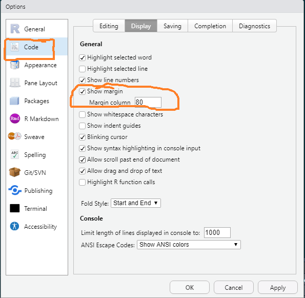
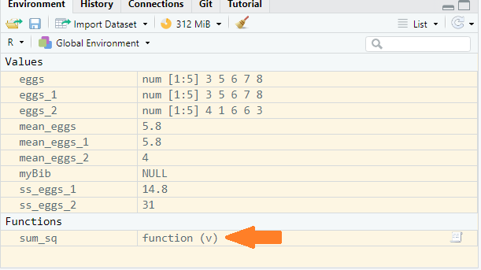

```{r setup, include=FALSE}
knitr::opts_chunk$set(echo = TRUE, 
                      message = FALSE,	
                      warning = FALSE,
                      fig.width = 4, 
                      fig.height = 4, 
                      fig.retina = 3)
options(htmltools.dir.version = FALSE)
```

```{r style-share-again, echo=FALSE}
xaringanExtra::use_share_again()
xaringanExtra::style_share_again(
  share_buttons = "all")
xaringanExtra::use_clipboard()
xaringanExtra::use_extra_styles(
  hover_code_line = TRUE,         
  mute_unhighlighted_code = TRUE)
```

```{r packages, include=FALSE}
library(RefManageR)
library(kableExtra)
library(tidyverse)
```


```{r, load-refs, include=FALSE, cache=FALSE}
BibOptions(check.entries = FALSE,
           bib.style = "authoryear",
           cite.style = "authoryear",
           style = "markdown",
           hyperlink = FALSE,
           dashed = FALSE,
           longnamesfirst = FALSE,
           max.names = 2)
myBib <- ReadBib("../refs.bib", check = FALSE)
```

<style>
div.blue { background-color:#b0cdef; border-radius: 5px; padding: 20px;}
div.grey { background-color:#d3d3d3; border-radius: 0px; padding: 0px;}
</style>

# Outline

The aim of this topic is show you more good programming practice:

-  in code styling and organisation
-  writing your own functions
-  literate programming with R Markdown  `r Cite(myBib, c("markdown1", "markdown2", "markdown3"))`. 

These build on the ideas about project organisation to allow you to conduct reproducible analyses. 


---
class: inverse

# Reproducibility is just good scientific practice

---
#  Good scientific practice

Analysis workflows should be structured and documented pipelines. 

-  Important in research collaboration and mandatory in many industry settings.   
-  Will likely become mandatory for science publication and funding. 
-  Will ultimately make your life much easier.  
-  Requires time, diligence and practice.  


---
# Reproducibility is a continuum

Some is better than none!

-  Organise your project See [Topic 1 Project Organisation](01_project_organisation.html).  
-  Script **everything**.  
-  Format code and follow a consistent style.  
-  Code algorithmically / algebraically.
-  Modularise your code :organise into sections, scripts, functions, packages 
-  Document your project - code commenting, licenses, READMEs 
-  Use literate programming e.g., R Markdown
-  Version control, continuous integration, environments, containers

---
class: inverse

# Code formatting and style

---
#  Code formatting and style

*"Good coding style is like correct punctuation: you can manage without it, butitsuremakesthingseasiertoread. "*
[The tidyverse style guide](https://style.tidyverse.org/) 


We have all written code which is hard to read. We all improve over time.

```{r echo=FALSE, tweet-from-hadley}
tweetrmd::include_tweet("https://twitter.com/hadleywickham/status/589068687669243905")
```


---
#  Code formatting and style
Some keys points:

* be consistent, emulate experienced coders  
* use snake_case for variable names (not CamelCase, dot.case or kebab-case)  
* use `<-` not `=` for assignment  
* use spacing around most operators and after commas  
* use indentation  
* avoid long lines, break up code blocks with new lines  
* use `"` for quoting text (not `'`) unless the text contains double quotes  
* do use kebab-case in rmarkdown code chunk names (see markdown later)  

---
class: inverse

# `r emo::ji("goblin")` Ugly code `r emo::ji("goblin")`

---
#  Ugly code

.code50[
```{r eval=FALSE}
data<-read_csv('../data-raw/Y101_Y102_Y201_Y202_Y101-5.csv',skip=2)
library(janitor);sol<-clean_names(data)
data=data%>%filter(str_detect(description,"OS=Homo sapiens"))%>%filter(x1pep=='x')
data=data%>%
mutate(g=str_extract(description,
"GN=[^\\s]+")%>%str_replace("GN=",''))
data<-data%>%mutate(id=str_extract(accession,"1::[^;]+")%>%str_replace("1::",""))
```
]

--

* no spacing or indentation
* inconsistent splitting of code blocks over lines
* inconsistent use of quote characters
* no comments
* variable names convey no meaning
* use of `=` for assignment and inconsistently
* multiple commands on a line
* library statement in the middle of 'analysis'

---
class: inverse

# `r emo::ji("sunglasses")` Cool code `r emo::ji("sunglasses")`
---
#  Cool code

.code50[
```{r eval=FALSE}
########################### Data import ########################### 
# define file name
filesol <- "../data-raw/Y101_Y102_Y201_Y202_Y101-5.csv"

# import: column headers and data are from row 3
sol <- read_csv(filesol, skip = 2) %>% 
  janitor::clean_names()


############################ Tidy Data ############################ 
# filter out the bovine proteins and those proteins 
# identified from fewer than 2 peptides
sol <- sol %>% 
  filter(str_detect(description, "OS=Homo sapiens")) %>% 
  filter(x1pep == "x")

# Extract the genename from description column to a column
# of its own
sol <- sol %>%
  mutate(genename =  str_extract(description,"GN=[^\\s]+") %>% 
           str_replace("GN=", ""))

# Extract the top protein identifier from accession column (first
# Uniprot ID after "1::") to a column of its own
sol <- sol %>%
  mutate(protid =  str_extract(accession, "1::[^;]+") %>% 
           str_replace("1::", ""))
```
]

---
#  `r emo::ji("sunglasses")` Cool code Tips

* to correct indentation <div class = "blue">CONTROL+i</div>
* to reformat code <div class = "blue">CONTROL+SHIFT+A</div> Not perfect but corrects spacing, indentation, multiple commands on lines and assignment with `=`
* to comment and uncomment lines <div class = "blue">CONTROL+SHIFT+C</div>

---
#  `r emo::ji("sunglasses")` Cool code Tips

* show the margin Tools | Global Options | Code

```{r echo = FALSE, out.width="60%", fig.cap="the Tools - Global Options - Code - tab where the box for show margin is highlighted"}

```

---
class: inverse

# Code 'algorithmically'

---
#  Code 'algorithmically.'

* Write code which expresses the structure of the problem/solution.
* Avoid hard coding numbers if at all possible - declare variables instead
* Declare frequently used values as variables at the start e.g., colour schemes, figure saving settings and chunk options (see R Markdown later)

---
#  Code 'algorithmically'

`r emo::ji("goblin")` Hard coding numbers.

Suppose we want to calculate the sums of squares, $SS(x)$, for the number of eggs in five nests. 

The formula is given by: $\sum (x_i- \bar{x})^2$  

We could calculate the mean and copy it, and the individual numbers into the formula


---
#  Code 'algorithmically'

`r emo::ji("goblin")` Hard coding numbers.

```{r}
# mean number of eggs per nest
sum(3, 5, 6, 7, 8) / 5

# ss(x) of number of eggs
(3 - 5.8)^2 + (5 - 5.8)^2 + (6 - 5.8)^2 + (7 - 5.8)^2 + (8 - 5.8)^2
```

--
I am coding the calculation of the mean rather using the `mean()` function only to explain what 'coding algorithmically' means using a simple example.

---
#  Code 'algorithmically'

`r emo::ji("goblin")` Hard coding numbers

* if any of the sample numbers must be altered, all the code needs changing
* it is hard to tell that the output of the first line is a mean
* its hard to recognise that the numbers in the mean calculation correspond to those in the next calculation
* it is hard to tell that 5 is just the number of nests
* no way of know if numbers are the same by coincidence or they refer to the same thing


---
#  Code 'algorithmically'

`r emo::ji("sunglasses")` Better

```{r}
# eggs per nest
eggs <- c(3, 5, 6, 7, 8)
# mean eggs per nest
mean_eggs <- sum(eggs) / length(eggs)
# ss(x) of number of eggs
sum((eggs - mean_eggs)^2)
```
---
#  Code 'algorithmically'

`r emo::ji("sunglasses")` Better
* the commenting is similar but it is easier to follow
* if any of the sample numbers must be altered, only that number needs changing
* assigning a value you will later use to a variable with a meaningful name allows us to understand the first and second calculations
* makes use of R's elementwise calculation which resembles the formula (i.e., is expressed as the general rule)

---
#  Code 'algorithmically'

`r emo::ji("sunglasses")` Even better - use existing functions where you can

```{r}
# eggs per nest
eggs <- c(3, 5, 6, 7, 8)
# mean eggs per nest
mean_eggs <- mean(eggs)
# ss(x) of number of eggs
sum((eggs - mean_eggs)^2)
```


---
class: inverse

# Writing functions

---
#  Writing functions

Putting code that you will use more than once in a function is efficient and makes your code easier to read.

Suppose we had two samples of the number of eggs in nests. We could do this:
.code60[
```{r}
####  Sample 1 ####
# eggs per nest
eggs_1 <- c(3, 5, 6, 7, 8)
# mean eggs per nest
mean_eggs_1 <- mean(eggs_1)
# ss(x) of number of eggs
ss_eggs_1 <- sum((eggs - mean_eggs_1)^2)

####  Sample 2 ####
# eggs per nest
eggs_2 <- c(4, 1, 6, 6, 3)
# mean eggs per nest
mean_eggs_2 <- mean(eggs_2)
# ss(x) of number of eggs
ss_eggs_2 <- sum((eggs - mean_eggs_2)^2)
```
]
---
#  Writing functions

Instead, we can create a function for repeated use. Functions are useful because they generalise a process thus making it reproducible without copying and pasting.

--

A function is defined by an assignment of the form:

```{r eval=FALSE}
functionname <- function(arg1, arg2, ...) {
  expression
  }
```

--

The `expression` is any R code that uses the arguments (arg1 etc) to calculate a value. In our case it will be the formula: $SS(x) = \sum (x_i- \bar{x})^2$ 

---
#  Writing functions

We define our $SS(x)$ function like this:

```{r}
sum_sq <- function(v) {
  sum((v - mean(v))^2)
  }
```

--

I chose `v`, as a name, arbitrarily. It doesn't matter what you call it. It only exists inside the function when the function is called. It acts as a place holder for the thing that you pass in. 

--

Our function take one argument. The expression describes what the function should do with the argument passed. 

---
#  Writing functions

When you run the code that defines the function, it will appear in your environment window.

```{r echo = FALSE, out.width="70%", fig.cap="the environment window"}

```

---
#  Writing functions

To call the function:

```{r}
sum_sq(eggs_1)
sum_sq(eggs_2)
```

---
#  Writing functions

You can put your functions in one of two places:

1. at the beginning of your analysis in a section for defining functions.

2. better: put the function in a file of its own then `source()` it before calling it:
```{r eval=FALSE}
source("functions/sum_sq.R")
sum_sq(eggs_1)
```

Or in Rmarkdown:

```{r eval=FALSE}
source("functions/sum_sq.R", local = knitr::knit_global())
sum_sq(eggs_1)
```

---
class: inverse

# R Markdown

---
#  Reproducible Reports: R Markdown

How do you work?

* What program do you analyse your data in?  
* What program do you plot your data in?  
* What program do you use to write up the results to submit for assessment or to a journal?
* What is your process for getting your summary data, statistical results, tables and figures in to your report?  
* What do you do when you get additional data that increases your sample sizes?  
* What do you do if you wrote in Word formatted for one journal and now have to submit in PDF formatted for another?

---
#  Reproducible Reports: R Markdown

Typically people analyse, plot and write up in different programs. 

Graphs are saved to files and copied and pasted into the final report. 

This process relies on manual labour. 

--

If the data changes, or you want to add a table or figure, you must repeat the entire process to update the report and renumber all your figures and all the  references to figures.

If you have ever had do this, you'll know it is time consuming but also very error prone.

---
background-image: url(../pics/rmarkdown.png)
background-position: 85% 85%
background-size: 180px

# Reproducible Reports: R Markdown

The brilliance of R Markdown `r Cite(myBib, c("markdown1","rmarkdown2"))` is that you can use a **single R Markdown file** to:

* save and execute code  

--

* do all your data processing, analysis and plotting  

--

* generate high quality reports that can be shared with an audience  

--

This is known as literate programming `r Cite(myBib, "Knuth1984-ly")`. 


`r emo::ji("sunglasses")`

---
# Reproducible Reports: R Markdown

## Many output formats are supported!

.pull-left[
```{r echo = FALSE, out.width="100%", fig.cap="r markdown formats"}
knitr::include_graphics("../pics/rmarkdownoutputformats.png")
```

]
.pull-right[
* Word, PDF, journal article formats for many journals
* Webpages - many styles and themes
* webslides
* powerpoint
* books
* blogs
* posters
* web applications including interactivity

]

---
# Reproducible Reports: R Markdown

`r emo::ji("clapper")` This might be a good time to watch the demo

---
# Reproducible Reports: R Markdown

Key points from the demo. R Markdown.......

* mixes text and code  
* is human readable  
* has a YAML header, containing "metadata", between the  \-\-\- 
* code chunk options control whether the code and its output end up in your 'knitted' document  
* comments   
  * in a code chunk the `#` is used for comments as normal  
  * in text comments are written like this:  `<!-- a comment -->`
  * but Ctrl+Shift+C will do context-specific comments  
* \# in the text indicate headings  
* Formatting `**bold**`, `*italics*`


---
# Reproducible Reports: R Markdown

Create your own R markdown file

`r emo::ji("clapper")` File | New File | R Markdown

--

`r emo::ji("clapper")` Delete everything except the YAML header the first code chunk

--

`r emo::ji("clapper")` Add your name, and a title 

---

# Reproducible Reports: R Markdown

`r emo::ji("clapper")` Edit the YAML. I recommend using the `bookdown` package `r Cite(myBib, "bookdown")`  for output types which handle cross referencing well. We will do cross referencing in the next Topic.

```
---
title: "My awesome title"
author: "Emma Rand"
output:
  bookdown::pdf_document2: default
  bookdown::word_document2: default
  bookdown::html_document2: default
---
```

---
# Reproducible Reports: R Markdown

`r emo::ji("clapper")` Set some **default** code chunk options. I recommend these:

.code80[

````
```{r setup, include=FALSE}`r ''`
knitr::opts_chunk$set(echo = FALSE, 
                      warning = FALSE,
                      message = FALSE,
                      fig.retina = 3)
```
````
]

--

`echo = FALSE` code will not be included in the output - normally what you want in a report.

`warning = FALSE` and `message = FALSE` R messages and warnings will not be included

`fig.retina = 3` for improving the appearance of R figures in HTML documents

---
# Reproducible Reports: R Markdown

## Organise code into sections.

Separate code for each process: set up, package loading, data import, data tidying, different analyses, figures etc.

-  separate code chunks
-  separate files that you source
-  a sensible combination of the the two


The first two code chunks are usually for the default code chunk options (which I tend to call `setup`) and for package loading. 

---
# Reproducible Reports: R Markdown

`r emo::ji("clapper")` Use Insert | R to add a code chunk:

.pull-left[
````
```{r packages}`r ''`
library(tidyverse)
```
````
]
.pull-right[
* `r`indicates it is an R code chunk
* `packages` is just a name for the chunk. Naming chunks makes debugging easier.

]


---
# Summary


.font90[
* R Markdown interweaves analysis code and reporting and is human readable  
* metadata about the document is given YAML header  
* there are many formats for outputs and several packages available  
* code chunk behaviour can be set 
* `#` is a heading in the text
* Use Ctrl+Shift+C for do context-specific comments
* Formatting: **\*\*bold\*\* **, * \*italics\* *
* Organise code into sections
* Use a consistent style particularly in terms of indentation, spacing and variable names
* Modularise your code by writing functions
* Code algorithmically
]

---
# Reading

## Strongly recommended

* Good enough practices in scientific computing `r Cite(myBib, "Wilson2017-cp")`
* The tidyverse style guide `r Cite(myBib, "Wickham-style")` Chapter 2 Syntax

---
# References
.font50[
.footnote[
Slides made with xaringan `r Cite(myBib, "xaringan")`,  xaringanExtra `r Cite(myBib, "xaringanExtra")`, xaringanthemer `r Cite(myBib, "xaringanthemer")` and RefManageR `r Cite(myBib, "RefManageR")` 

]

```{r refs, echo=FALSE, results="asis"}
PrintBibliography(myBib)
```

]
---

Emma Rand <br> [emma.rand@york.ac.uk](mailto:emma.rand@york.ac.uk) <br> Twitter: [@er13_r](https://twitter.com/er13_r) <br> GitHub: [3mmaRand](https://github.com/3mmaRand)  <br> blog: https://buzzrbeeline.blog/
<br>
<br>
<a rel="license" href="http://creativecommons.org/licenses/by-nc-sa/4.0/"></a><br /><span xmlns:dct="http://purl.org/dc/terms/" property="dct:title">Data Science strand of BIO00058M</span> by <span xmlns:cc="http://creativecommons.org/ns#" property="cc:attributionName">Emma Rand</span> is licensed under a <a rel="license" href="http://creativecommons.org/licenses/by-nc-sa/4.0/">Creative Commons Attribution-NonCommercial-ShareAlike 4.0 International License</a>.
