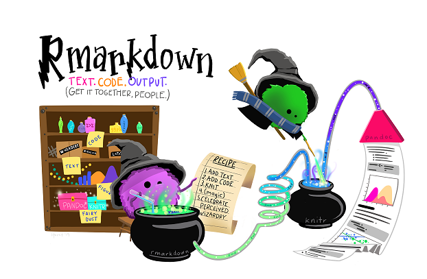

```{r setup, include=FALSE}
knitr::opts_chunk$set(echo = TRUE, 
                      message = FALSE,	
                      warning = FALSE,
                      fig.width = 4, 
                      fig.height = 4, 
                      fig.retina = 3)
options(htmltools.dir.version = FALSE)
```

```{r style-share-again, echo=FALSE}
xaringanExtra::use_share_again()
xaringanExtra::style_share_again(
  share_buttons = "all")
xaringanExtra::use_clipboard()
xaringanExtra::use_extra_styles(
  hover_code_line = TRUE,         
  mute_unhighlighted_code = TRUE)
```

```{r packages, include=FALSE}
library(RefManageR)
library(kableExtra)
library(tidyverse)
```


```{r, load-refs, include=FALSE, cache=FALSE}
BibOptions(check.entries = FALSE,
           bib.style = "authoryear",
           cite.style = "authoryear",
           style = "markdown",
           hyperlink = TRUE,
           dashed = FALSE,
           longnamesfirst = FALSE,
           max.names = 2)
myBib <- ReadBib("../refs.bib", check = FALSE)
```

<style>
div.blue { background-color:#b0cdef; border-radius: 5px; padding: 20px;}
div.grey { background-color:#d3d3d3; border-radius: 0px; padding: 0px;}
</style>

# Outline

The aim of this topic is to introduce more advanced use of R Markdown  `r Cite(myBib, c("markdown1", "markdown2"))` such as including special characters, images, figures and tables along with citations, referencing and cross referencing (with autonumbering).

```{r echo=FALSE}
file <- "../data-raw/chaff.txt"
chaff <- read_table2(file)

chaff <- chaff %>%
  pivot_longer(names_to = "sex", 
               values_to = "mass",
               cols = everything())

chaff_sum <- chaff %>% 
  group_by(sex) %>% 
  summarise(mean = mean(mass),
            n = length(mass),
            sd = sd(mass),
            se = sd/sqrt(n))
```

---
class: inverse

# Inline code

---
# Inline code

Inline code is needed to place the output of R commands in a piece of text rather than in a separate section as the output of a code chunk.

Inline code goes between ` `r` and ` ` ` within the text. 

For example, by writing: 

The square root of 2 is ` `r`  `sqrt(2)` ` ` ` in a text section of the Rmd....

--

....You will get: 

> The square root of 2 is  `r sqrt(2)`

in the knitted output. The inline code executes and the result is placed in the text.

---
# Inline code

This is often needed to access and report analysis variables, such as a mean. 

--

For example, suppose you had a dataframe, `chaff_sum` like this:
```{r echo=FALSE}
chaff_sum
```
We might want to report the means and standard errors along with which was the highest.

---
# Inline code

We could write something like this in the text of the Rmd: 

The mean mass of males is ` `r`  `chaff_sum$mean[chaff_sum$sex == "males"]` ` ` ` g. 

--

To get: 

> The mean mass of males is  `r chaff_sum$mean[chaff_sum$sex == "males"]` g.

in the knitted output

---
# Inline code

Long sections of inline code can make it difficult to read the Rmd text or understand what quantity is being calculated. 

To improve readability, I usually add code chunks to calculate or extract the values I want to report.

.code80[
```{r extract}
# extract values for inline reporting
# highest mean, se and the sex to which they belongs
highestmean <- max(chaff_sum$mean) 
highestse <- chaff_sum$se[chaff_sum$mean == highestmean] 
highestsex <- chaff_sum$sex[chaff_sum$mean == highestmean]
highestmean <- round(highestmean, 2)
highestse  <- round(highestse, 2)
```
]

---
# Inline code

We could write something like: 

` `r`  `str_to_sentence(highestsex)` ` ` ` are the heavier at ` `r`  `highestmean` ` ` ` $\pm$ ` `r`  `highestse` ` ` ` g in a text section of the Rmd

--

To get: 

> `r str_to_sentence(highestsex)` are the heavier at `r highestmean` $\pm$ `r highestse` g

in the knitted output

---
class: inverse

# Images and links

---
#  Images and links

Links are created using the syntax `[text](link)`. For example: 

`[R Markdown: The Definitive Guide](https://bookdown.org/yihui/rmarkdown/)` in the Rmd gives you:

[R Markdown: The Definitive Guide](https://bookdown.org/yihui/rmarkdown/) in the knitted output.


The syntax for images is the same with an extra exclamation mark at the start: ``


---
#  Images and links

So: ``.

Gives you


---
#  Images

My preferred way of including images is to use the **`knitr`** function `include_graphics` in a code chunk:

.code70[
````
```{r out.width="30%", fig.cap="R Markdown wizards by Allison Horst."}`r ''`

```
````
]

```{r echo=FALSE, out.width="30%", fig.cap="R Markdown wizards by Allison Horst."}

```

This partly for better control of the size and captioning but also to more easily use cross referencing (see later).
---
class: inverse
# Tables

---
#  Tables

There are several options for formatting tables. I tend to use
`knitr::kable()` with the [**`kableExtra`**](https://cran.r-project.org/web/packages/kableExtra/vignettes/awesome_table_in_html.html#table_styles) package `r Cite(myBib, "kableExtra")` which work well with the pipe. 

--

The **`gt`** `r Cite(myBib, "gt")` and **`flextable`** packages `r Cite(myBib, "flextable")` are also good.

---
#  Tables

`kable()` does a decent basic table with some options for formatting. For example
.code60[
```{r}
chaff_sum %>% 
  knitr::kable(caption = "Summary statistics for Chaffinches",
               digits = 2,
               col.names = c("Sex", 
                             "Mean", 
                             "N",
                             "Stdev",
                             "Stder"))
```
]


---
#  Tables

[**`kableExtra`**](https://cran.r-project.org/web/packages/kableExtra/vignettes/awesome_table_in_html.html#table_styles) package `r Cite(myBib, "kableExtra")` gives you more formatting options which you can pipe onto your basic `kable()` table:

.code60[
```{r chaff-table}
chaff_sum %>% 
  knitr::kable(caption = "Summary statistics for Chaffinches",
               digits = 2,
               col.names = c("Sex", 
                             "Mean", 
                             "N",
                             "Stdev",
                             "Stder")) %>%
  kable_styling(font_size = 15) %>% 
  add_header_above(c(" " = 1, "Mass" = 4)) %>% 
  row_spec(row = 0, background = "#9d5e78") 

```
]

---
class: inverse

# Special characters

---
#  Special characters

You can include special characters in a markdown document using LaTeX markup. 

--

This has $ signs on the outside and uses backslashes and curly braces to indicate that what follows should be interpreted as a special character with special formatting.

--

For example, to get $\bar{x} \pm s.e.$ you write `$\bar{x} \pm s.e.$`

---
class: inverse

# References and citations

---
#  References and citations

These are added using .bib file and adding a line to the YAML header

--

A .bib file is a plain text file containing references in BibTeX format. An example is [here](https://github.com/3mmaRand/BIO00058M-Data-science-2020/blob/master/refs.bib)

--

The YAML line to be added is `bibliography: mybibfile.bib` 

--

`citation("package")` in the console will give packages references in BibTeX format.

--

BibTeX files can be downloaded from most referencing software (e.g., PaperPile).

---
#  References and citations

Citations are added using:
  *  blah blah blah `[@xaringan]` for blah blah blah `r Cite(myBib, "xaringan")`.    
  *  Xie `[-@xaringan]` said blah blah blah for `r Cite(myBib, "xaringan",textual = TRUE)` said blah blah blah.  

--

If you have installed the `citr` package there is an Addin to help with this.

--

Every citation used results in the reference being added to a list at the bottom of the output.


---
#  References and citations

There are other ways of including references such as using `RefManageR` package which is what I am using in these slides.

---
class: inverse

# Cross referencing

---
#  Cross referencing

You can automatically number figures and tables without having to update the numbers if you add or move a figure or table. The cross references to tables and figures such as "See Table 1" will also update without your intervention.

--

The general syntax for cross-referencing in the text part of an Rmd is `\@ref(label)` where label can be:  

`tab:name-of-chunk-that-makes-a-table` or  
`fig:name-of-chunk-that-makes-a-figure`

`r emo::ji("eyes")` Something to take note of here: You **cannot** use underscores in chunk names! Use hyphens or spaces instead. Yes, you can use spaces.

---
#  Cross referencing tables

In order for tables to be automatically numbered, and to allow you to cross-reference them in the text, you need to ensure two things in the chunk that generates them:

1. the chunk must be labelled. I've used `chaff-table` on the next page 
2. the table must have a caption as set by the `caption` argument

--

`r emo::ji("exclamation_mark")` The caption does not have to include "Table 1." 

---
#  Cross referencing tables


````
```{r chaff-table}`r ''`
chaff_sum %>% 
  knitr::kable(caption = "Summary statistics for Chaffinches",
               digits = 2,
               col.names = c("Sex", 
                             "Mean", 
                             "N",
                             "Stdev",
                             "Stder"))
```
````

To refer to this table in the text, we use: See Table `\@ref(tab:chaff-table)`


---
#  Cross referencing figures

In order for figures to be automatically numbered, and to allow you to cross-reference them in the text, you need to ensure two things in the chunk:

1. the chunk must be labelled. I'll used `chaff-fig`  
2. the figure must have a caption *but* this time it is set in the code chunk options using `fig.cap` 

--

`r emo::ji("exclamation_mark")` The caption does not have to include "Figure 1."

---
#  Cross referencing figures

````
```{r chaff-fig, fig.cap="Mass of male and female Chaffinches"}`r ''`
ggplot() +
  geom_violin(data = chaff, aes(x = sex, y = mass))
```
````

--

I have labelled the chunk `chaff-fig` and set the caption with `fig.cap`.

To refer to this figure in the text, we use: See Figure `\@ref(fig:myo-fig)`

---
#  Cross referencing figures

Figure legends can be very long and include special characters which don't work well in within `{r chaff-fig, fig.cap="Mass of male and female Chaffinches"} `

Figures legends can instead be defined in the text part of the Rmd with: 

(ref:chaff-fig) Mass of male and female Chaffinches

And then use use that reference for the `fig.cap` argument in the chunk options:

````
```{r chaff-fig, fig.cap='(ref:chaff-fig)'}`r ''`
ggplot() +
  geom_violin(data = chaff, aes(x = sex, y = mass))
```
````


---
# Summary

.font90[

* Inline code goes between ` `r` and ` ` ` within the text  
* Avoid long inline commands by extracting the required values in code chunks  
* `knitr::kable()` prints a dataframe/tibble as a well-formatted table which can be customised using `kableExtra`  
* LaTeX can be used to format mathematical equations and include special characters  
* references are held in a BibTeX file (.bib) given in the YAML header  
* cross referencing relies on chunks being named and the use of captions  
  * table captions are given in the` knitr::kable()` command
  * figure cpations are given in the code chunk options  
* the general syntax for cross-referencing in the text part of an Rmd is `\@ref(label)`


]

---
# Reading

Peruse and book mark these:

* [R Markdown: The Definitive Guide](https://bookdown.org/yihui/rmarkdown/) `r Cite(myBib, "markdown2")` by Yihui Xie, J. J. Allaire, Garrett Grolemund

* [R Markdown Cookbook](https://bookdown.org/yihui/rmarkdown-cookbook/) `r Cite(myBib, "rmarkdown_cookbook")` by Yihui Xie, Christophe Dervieux, Emily Riederer. As a cookbook, this guide is recommended to new and intermediate R Markdown users who desire to enhance the efficiency of using R Markdown and also explore the power of R Markdown.

* [bookdown: Authoring Books and Technical Documents with R Markdown](https://bookdown.org/yihui/bookdown/) `r Cite(myBib, "bookdown")`


---
# References

.font90[
```{r refs1, echo=FALSE, results="asis"}
PrintBibliography(myBib, start = 1, end = 4)
```
]
---
# References
.font90[
```{r refs2, echo=FALSE, results="asis"}
PrintBibliography(myBib, start = 5)
```
]

.font70[
.footnote[
Slides made with with xaringan `r Cite(myBib, "xaringan")` and xaringanExtra `r Cite(myBib, "xaringanExtra")`
]
]
---

## Emma Rand <br> [emma.rand@york.ac.uk](mailto:emma.rand@york.ac.uk) <br> Twitter: [@er13_r](https://twitter.com/er13_r) <br> GitHub: [3mmaRand](https://github.com/3mmaRand)  <br> blog: https://buzzrbeeline.blog/
<br>
<a rel="license" href="http://creativecommons.org/licenses/by-nc-sa/4.0/"></a><br /><span xmlns:dct="http://purl.org/dc/terms/" property="dct:title">Data Science strand of BIO00058M</span> by <span xmlns:cc="http://creativecommons.org/ns#" property="cc:attributionName">Emma Rand</span> is licensed under a <a rel="license" href="http://creativecommons.org/licenses/by-nc-sa/4.0/">Creative Commons Attribution-NonCommercial-ShareAlike 4.0 International License</a>.
