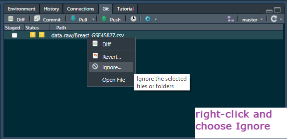

```{r setup, include=FALSE}
knitr::opts_chunk$set(echo = TRUE, 
                      message = FALSE,	
                      warning = FALSE,
                      fig.width = 4, 
                      fig.height = 4, 
                      fig.retina = 3)
options(htmltools.dir.version = FALSE, digits = 4)
```

```{r style-share-again, echo=FALSE}
xaringanExtra::use_share_again()
xaringanExtra::style_share_again(
  share_buttons = "all")
xaringanExtra::use_clipboard()
xaringanExtra::use_extra_styles(
  hover_code_line = TRUE,         
  mute_unhighlighted_code = TRUE)
```

```{r packages, include=FALSE}
library(RefManageR)
library(kableExtra)
```


```{r, load-refs, include=FALSE, cache=FALSE}
BibOptions(check.entries = FALSE,
           bib.style = "authoryear",
           cite.style = "authoryear",
           style = "markdown",
           hyperlink = TRUE,
           dashed = FALSE,
           longnamesfirst = FALSE,
           max.names = 2)
myBib <- ReadBib("../refs.bib", check = FALSE)
```

<style>
div.blue { background-color:#b0cdef; border-radius: 5px; padding: 20px;}
div.grey { background-color:#d3d3d3; border-radius: 0px; padding: 0px;}
</style>


# Outline

In a previous topic you were introduced to machine learning. You learnt that ML is statistical methods for exploring, summarising and modelling data and that it can be used for:

* visualisation of high dimensional data  
* discovering patterns/clusters in variables or observations  
* making predictions  
* classifying observations  

--

You also learnt that ML methods can be characterised as supervised or unsupervised and applied two unsupervised methods: Principal Component Analysis (PCA) and *t*-distributed Stochastic neighbour embedding (*t*-SNE)

---
# Outline

The aim of this topic is to introduce you to a specific supervised learning method, Linear Discriminant Analysis, which will illustrate some general concepts in supervised learning such as overfitting, training and testing and confusion matrices. 


---
# Linear Discriminant Analysis

Linear Discriminant Analysis (LDA) aims to find linear combination of variables the maximise differences between groups. 

--

It is supervised because we *label* observations by their class and determine the allocation rules based on these. 

--

A ‘discriminant’ is a linear combination of variables that best separates the groups. If there $n$ classes we have, at most, $n-1$ discriminants. 

--

The `lda()` function is in a package called **`MASS`** `r Cite(myBib, "venables_ripley")` which is part of the base R distribution so you do not need to install it. 

`r emo::ji("exclamation")` Do not load the package!


---
# Training and testing

When we a take a hypothesis testing perspective in which the goal is to explain a response and determine whether specific variables have a significant effect on the response, we  typically use all the data we have. 

--

A problem with this approach is that we cannot be sure model we have fitted to our data is generalisable. That is, we do not know how well the model would predict the responses for a new data set.  This is known as *overfitting*.

--

Overfitting is when your model fits the data you have very well but does not generalise. You can think of it as fitting the random variation in the data in addition to the non-random variation.

---
# Training and testing

A key concept of using supervised ML methods build the model on approximately 75% of the data and test it on the remaining 25%. Building the model is known as 'training' the model.

--

The **`caret`** package `r Cite(myBib, "caret")` includes functions to facilitate training and testing  - in addition to many ML algorithms. 

--

The name comes from *C*lassification *A*nd *RE*gression *T*raining. Max Kuhn's work on ML in R has been extremely influential. 

--

His most recent work is on tidymodels `r Cite(myBib, "Tidymodels")` a collection of packages for modelling and ML using the tidyverse paradigm.


---
# Outline

In these slides show you will apply:

* LDA to the Penguin data *without* training and testing  
* LDA to the Penguin data *with* training and testing  
* LDA to the scRNASeq data *with* training and testing but we will consider how good the model is at predicting classes from the training set comapred to the test set. 

--

You should be able to code along with the examples. When you see the film clapper it is ..

`r emo::ji("clapper")` .. an instruction to do something!!

---
# Set up

I suggest having a different RStudio Project for each dataset we use. You might want to reopen those you used for the Penguins data and the scRNASeq data respectively.

--

Note that you can have multiple instances of RStudio running to allow you to work on more than one RStudio Project.

--

Create directory structure for each RStudio Project, write your analysis in R Markdown with named chunks which are well organised. 

---
# Set up

Load the **`tidyverse`**, **`caret`** and **`GGally`** and for each RStudio Project.

```{r}
library(tidyverse)
library(caret)
library(GGally)
```

Do not load **`MASS`**, we will access the `lda()` function with `MASS::lda()` instead.

---
# Important!

If you are using git and especially if you intend to push to GitHub, do **not** track the data files in second example.

You prevent tracking by adding the file to a .gitignore. You can do this by right-clicking on the file in the git pane and choosing 'Ignore'




---
class: inverse

#  LDA on Penguins without training and testing


---
# Penguin LDA

We use the Palmer penguins again. You can read more about this dataset in [Introduction to palmerpenguins](https://allisonhorst.github.io/palmerpenguins/articles/intro.html).


`r emo::ji("clapper")` Load the package to get the data: 
```{r}
library(palmerpenguins)
```

`r emo::ji("clapper")` Clean the variable names for ease of use: 
```{r}
penguin <- penguins_raw %>%
  janitor::clean_names()
```

---
# Penguin LDA: tidy

We repeat the simple filtering and tidying we did previously.

`r emo::ji("clapper")` Filter out the rows with missing values: 

```{r}
penguin <- penguin %>% 
  filter(!is.na(body_mass_g))
```

`r emo::ji("clapper")` Split `species` into `common_name` and `scientific_name`: 
```{r}
penguin <- penguin %>% 
  extract(species, 
          c("common_name", "scientific_name"),
          "([a-zA-Z]+\\s[a-zA-Z]+)\\s\\(([a-zA-Z]+\\s[a-zA-Z]+)\\)")
```


---
# Penguin LDA: build model

Now to run the LDA. 

`r emo::ji("clapper")` Select the four variables and pipe into the `MASS::lda()` function which does the PCA:

```{r}
lda <- penguin %>% 
  select(body_mass_g,
         ends_with("_mm")) %>%
  MASS::lda(grouping = penguin$common_name)
```

--

We have saved the result to a list object called `lda`

---
# Penguin LDA: build model

This is a good example of when we definitely want to use `package::function()`. 

**`MASS`** has a function called `select()` like **`dplyr`**, but it works differently (the function is defined differently).

You can spend hours of your life wondering what is wrong with your code when it looks fine and worked before if you load both packages. I have done this with these particular functions too many times!

---
# Penguin LDA: examine model

Just as we could see the importance of each variable in each Principal Component using `pca$loadings`, we can see the importance of each variable in each discriminant using `lda$scaling`.

`r emo::ji("clapper")` View the importance of each variable in each discriminant:
.code70[
```{r}
lda$scaling
```
]
```{r echo=FALSE}
a <- lda$scaling["body_mass_g", "LD1"]
b <- lda$scaling["culmen_length_mm", "LD1"]
c <- lda$scaling["culmen_depth_mm", "LD1"]
d <- lda$scaling["flipper_length_mm", "LD1"]
```

---
# Penguin LDA: examine model

$LD1=$ `r a` $body\_mass\_g +$ `r b` $culmen\_length\_mm +$ `r c` $culmen\_depth\_mm +$ `r d` $flipper\_length\_mm$

You might want to compare to the [loadings for PCA](05_intro_to_ML_unsupervised.html#41)

---
# Penguin LDA: predict classes

The generic function `predict()` is used to give the species predicted by the model for each observation.

`r emo::ji("clapper")` Select the variables from `Penguin` that are in the model and predict the species from the `lda` model object:

```{r}
plda <- penguin %>% 
  select(body_mass_g,
         ends_with("_mm")) %>%
  predict(object = lda)
```

---
# Penguin LDA: Confusion matrix

**`caret`** provides us with a useful function to examine the *confusion matrix*. 

--

A confusion matrix is a table that tells us about the performance of a classification model. 
--

The table gives the number of:

* correct predictions: the species predicted matches the observed species  
* incorrect predictions: the species predicted does not match the observed species.
for each species.  

---
# Penguin LDA: Confusion matrix

The `confusionMatrix()` function also outputs:

* Accuracy - No. correct predictions / No. of observations 
* 95% CI - 95 percent confidence interval on the accuracy (using `binom.test()`)  
* No Information Rate - No. observations in the largest class / Number of observations   
* P-Value [Acc > NIR] - Is the model significantly better than than you could do by always predicting the most common class (again using `binom.test()`).  

---
# Penguin LDA: Confusion matrix

`r emo::ji("clapper")` Examining the confusion matrix:

.scroll-output-height[
```{r}
confusionMatrix(plda$class, factor(penguin$common_name))
```
]

---
# Penguin LDA: Confusion matrix


```{r echo=FALSE}
res <- confusionMatrix(plda$class, factor(penguin$common_name))
accuracy <- res$overall["Accuracy"]*100

adelie_num <- sum(res$table[,"Adelie Penguin"])
adelie_wrong <- res$table["Chinstrap penguin","Adelie Penguin"] + res$table["Gentoo penguin","Adelie Penguin"] 

chin_num <- sum(res$table[,"Chinstrap penguin"])
chin_wrong <- res$table["Adelie Penguin","Chinstrap penguin"] + res$table["Gentoo penguin","Chinstrap penguin"] 

gentoo_num <- sum(res$table[,"Gentoo penguin"])
gentoo_wrong <- res$table["Chinstrap penguin","Gentoo penguin"] + res$table["Adelie Penguin","Gentoo penguin"] 
```

The model had an accuracy of `r accuracy`%. There were `r adelie_num` Adelie Penguins of which `r adelie_wrong` were predicted incorrectly; `r chin_num` Adelie Penguins of which `r chin_wrong` were predicted incorrectly; and `r gentoo_num` Adelie Penguins of which `r gentoo_wrong` were predicted incorrectly.

---
# Penguin LDA: plot

To plot, we might want to use the scores on each of the new axes and colour them by species. The scores are in a variable called `$x` in `plda`

`r emo::ji("clapper")` Extract the scores into a dataframe with the species names: 
```{r}
lda_labelled <- data.frame(plda$x,
                              common_name = penguin$common_name)

```

`r emo::ji("clapper")` Create a scatter plot: 

```{r peng-lda, fig.show='hide'}
lda_labelled %>% 
  ggplot(aes(x = LD1, y = LD2, color = common_name)) +
  geom_point() 
```

---
# Penguin LDA: plot

```{r ref.label = 'peng-lda', echo = FALSE, out.wdth="500px"} 
```

The separation between species is stronger in the LDA than in the[ PCA.](05_intro_to_ML_unsupervised.html#44)

---
class: inverse


#  LDA on Penguins with training and testing

---
# Penguin LDA: Train & test

We used the same data to train the LDA model as we used to examine its performance. Few were incorrectly classified. But this is not very robust - we could have overfitting.

We can use the **`caret`** function `createDataPartition()` to split the dataset in to training and testing sets. 

--

It returns a proportion of row numbers randomly sampled from the dataframe.

---
# Penguin LDA: Create train & test sets

`r emo::ji("clapper")` Create a vector of row numbers that will be used to split the dataset in to training and testing sets:
```{r}
ids <- createDataPartition(y = penguin$common_name,
                           p = 0.75,
                           list = FALSE)
```

`p` is the proportion of rows to sample.

`list = FALSE` gives me a vector of numbers rather than a one item list.

You might want to examine the `ids` variable.

---
# Penguin LDA: Create training set
Now we use those row numbers to select the rows from `penguin` to create the training and test datasets. We use the `dplyr` function slice which works like the filter function but filters rows on their index rather than a match to a condition.

`r emo::ji("clapper")` Create the training set:
```{r}
train <- penguin %>% slice(ids)
```

---
# Penguin LDA: Create testing set

The testing set is all the rows that are not in `ids`.

`r emo::ji("clapper")` Create the testing set:
```{r}
test <- penguin %>% slice(-ids)
```

--

You might want to examine the two dataframes, `train` and `test`, we just made.

---
# Penguin LDA: train model

The process of the using `lda()` and `predict()` is the same as previously but the input data differ.

`r emo::ji("clapper")` Perform the LDA on the training data:
```{r}
lda <- train %>% #<<
  select(body_mass_g,
         ends_with("_mm")) %>%
  MASS::lda(grouping = train$common_name) #<<
```

---
# Penguin LDA: test model

`r emo::ji("clapper")` And predict classes of the test data based on lda model:


```{r}
plda <- test %>% #<<
  select(body_mass_g,
         ends_with("_mm")) %>%
  predict(object = lda)
```

---
# Penguin LDA: Confusion matrix

`r emo::ji("clapper")` Examining the confusion matrix:
.scroll-output-height[
```{r}
confusionMatrix(plda$class,factor(test$common_name))
```
]
```{r echo=FALSE}
res <- confusionMatrix(plda$class, factor(test$common_name))
accuracy <- res$overall["Accuracy"]*100

```

The model had an accuracy of `r accuracy`%. You may have had greater or fewer because the training and testing sets were random selections.

---
class: inverse

#  LDA on single-cell RNASeq data with training and testing


---
# scRNASeq LDA

The data in [scrna_data.csv](../data-raw/scrna_data.csv) are the single-cell  RNASeq data we considered last week. Each row is a cell (an observation) and each column is a gene (a variable / feature). The values are gene expression values.

`r emo::ji("clapper")` Import the data and the cell labels: 
```{r}
file <- "../data-raw/scrna_data.csv"
rna <- read_csv(file)
file <- "../data-raw/scrna_meta.csv"
meta <- read_csv(file) %>% select(louvain)
```

---
# scRNASeq LDA

`r emo::ji("clapper")` Add the cell labels to the data: 

```{r}
rna$cell <- meta$louvain
```

---
# scRNASeq LDA: create train & test sets


`r emo::ji("clapper")` Split the dataset in to training and testing sets using `createDataPartition()`
```{r}
ids <- createDataPartition(y = rna$cell,
                           p = 0.75,
                           list = FALSE)
```


---
# scRNASeq LDA: create train & test sets

Now we use those row numbers to select the rows from `rna` to create the training and test datasets. 

`r emo::ji("clapper")` Create the training set:
```{r}
train <- rna %>% slice(ids)
```

`r emo::ji("clapper")` Create the testing set:
```{r}
test <- rna %>% slice(-ids)
```

---
# scRNASeq LDA: train model

`r emo::ji("clapper")` Perform the LDA on the training data:
```{r}
lda <- train %>% 
  select(-cell) %>%
  MASS::lda(grouping = train$cell)
```

---
# scRNASeq LDA: Performance

How well does our model perform on the training set data.

`r emo::ji("clapper")` Predict on the training data:


```{r}
plda_train <- train %>% 
  select(-cell) %>%
  predict(object = lda)
```

---
# scRNASeq LDA: Confusion matrix

`r emo::ji("clapper")` Examining the confusion matrix:
.scroll-output-height[
```{r}
confusionMatrix(plda_train$class,factor(train$cell))
```
]
```{r echo=FALSE}
res <- confusionMatrix(plda_train$class,factor(train$cell))
accuracy <- res$overall["Accuracy"]*100

```

The model had an accuracy of `r accuracy`%. Wow, that's good. Or is it??

---
# scRNASeq LDA: Performance on test

But what about performance on the test set? Is our modelling overftting? Would it be equally good on the scRNASeq data for a new dataset?

`r emo::ji("clapper")` Predict classes of the test data based on LDA model:

```{r}
plda_test <- test %>% 
  select(-cell) %>%
  predict(object = lda)
```

---
# scRNASeq LDA: Confusion matrix

`r emo::ji("clapper")` Examining the confusion matrix:
.scroll-output-height[
```{r}
confusionMatrix(plda_test$class, factor(test$cell))
```
]
```{r echo=FALSE}
res <- confusionMatrix(plda_test$class,factor(test$cell))
accuracy <- res$overall["Accuracy"]*100

```

The model had an accuracy of `r accuracy`%. That is much more honest and robust test.
---
# scRNASeq LDA: plots

We will plot the training data and then the test data.

`r emo::ji("clapper")` Extract the scores from the training set with the cell names: 
```{r}
lda_labelled_train <- data.frame(plda_train$x,
                              cell = train$cell)

```

`r emo::ji("clapper")` Extract the scores from the training set with the cell names: 
```{r}
lda_labelled_test <- data.frame(plda_test$x,
                              cell = test$cell)

```
---
# scRNASeq LDA: LD1 and LD2

`r emo::ji("clapper")` Create a scatter plot for the training data: 

```{r rna-lda-train, fig.show='hide'}
lda_labelled_train %>% 
  ggplot(aes(x = LD1, y = LD2, color = cell)) +
  geom_point() 
```

---
# scRNASeq LDA

```{r ref.label = 'rna-lda-train', echo = FALSE, out.width="700px", out.height="550px"} 
```

---
# scRNASeq LDA: plots

Based on this plot, you might be surprised by the accuracy of the model predictions on the training set - there seems to be a lot of overlap.

--

However, you are only looking at LD1 and LD2. There are many dimensions in this dataset and the separation of groups might not be obvious from the first to LD.

--

**`GGally`** `r Cite(myBib, "GGally")` can let us examine several pairwise LD comparisons.

---
# scRNASeq LDA: More LD

`r emo::ji("clapper")` Select the first 5 LDs and pipe in to `ggpairs()`: 

```{r rna-lda-train-pairs, fig.show='hide'}
lda_labelled_train %>% 
  select(LD1:LD5, cell) %>% 
  ggpairs(aes(color = cell))
```


---
# scRNASeq LDA: More LD

```{r ref.label = 'rna-lda-train-pairs', echo = FALSE,out.width="580px", out.height="580px"} 
```

---
# scRNASeq LDA:

You can see how LD1 really separates Megakaryocytes from the other cell types but that other LD are needed to distinguish all the cell types.

--

Now consider the test set.

---
# scRNASeq LDA: LD1 and LD2

`r emo::ji("clapper")` Create a scatter plot for the test data: 

```{r rna-lda-test, fig.show='hide'}
lda_labelled_test %>% 
  ggplot(aes(x = LD1, y = LD2, color = cell)) +
  geom_point() 
```

---
# scRNASeq LDA

```{r ref.label = 'rna-lda-test', echo = FALSE, out.width="700px", out.height="550px"} 

```

---
# scRNASeq LDA: plots

There's a lot of overlap here. Perhaps we will better see the difference by examining additional LDs. However, remember that the predictions were less good on the test set so we would expect it to be difficult to distinguish all cells.


---
# scRNASeq LDA: More LD

`r emo::ji("clapper")` Select the first 5 LDs and pipe in to `ggpairs()`: 

```{r rna-lda-test-pairs, fig.show='hide'}
lda_labelled_test %>% 
  select(LD1:LD5, cell) %>% 
  ggpairs(aes(color = cell))
```


---
# scRNASeq LDA

```{r ref.label = 'rna-lda-test-pairs', echo = FALSE,out.width="580px", out.height="580px"} 

```


---
# Summary

.font80[

* Linear discriminant analysis is a supervised ML method  
* It is applied when you have many continuous variables and allows you to visualised the data in fewer dimensions, and thus see group/patterns more easily.  
* LDA is a fast, linear, parametric method  
* the maximum number of discrimants is one fewer than the number of dimensions.
* overfitting occurs when a model too closely fits a limited set of data points and does not generalise  
* partitioning data into training and testing sets is the primary way to avoid overfitting  
* the performance of a classification model can be evaluated using a confusion matrix  
]

---
# Reading

## Strongly recommended

* The Assessment information!


---
# References
.font90[
```{r refs2, echo=FALSE, results="asis"}
PrintBibliography(myBib)
```
]

.font70[
.footnote[
Slides made with with xaringan `r Cite(myBib, "xaringan")` and xaringanExtra `r Cite(myBib, "xaringanExtra")`
]
]
---

## Emma Rand <br> [emma.rand@york.ac.uk](mailto:emma.rand@york.ac.uk) <br> Twitter: [@er13_r](https://twitter.com/er13_r) <br> GitHub: [3mmaRand](https://github.com/3mmaRand)  <br> blog: https://buzzrbeeline.blog/
<br>
<a rel="license" href="http://creativecommons.org/licenses/by-nc-sa/4.0/"></a><br /><span xmlns:dct="http://purl.org/dc/terms/" property="dct:title">Data Science strand of BIO00058M</span> by <span xmlns:cc="http://creativecommons.org/ns#" property="cc:attributionName">Emma Rand</span> is licensed under a <a rel="license" href="http://creativecommons.org/licenses/by-nc-sa/4.0/">Creative Commons Attribution-NonCommercial-ShareAlike 4.0 International License</a>.
