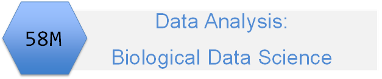

```{r setup, include=FALSE}
knitr::opts_chunk$set(echo = FALSE,
                      message = FALSE,
                      warning = FALSE)
```

```{r pkg}
library(tidyverse)
```


# Introduction

Work in pairs in BB Collaborate breakout to tackle the tasks.

<font size = "4">
`r  emo::ji("team")` Work together to complete the task. Take it in turns to share your screens.   
`r emo::ji("speech_balloon")` Communicate what you are doing and why  
`r emo::ji("document")` Document and share your ideas and process   
`r  emo::ji("team")` Consider having one person code and other documenting  
`r emo::ji("heart")` Be kind, be understanding, be flexible   
</font>


# Set up

1. Do the New project, GitHub first workflow
   * Make a new repo on GitHub and initialise with a README and license  
   * Clone the repo into a RStudio Project on your own machine  

2. Paste the address of your GitHub repo to the chat.  `r emo::ji("speech_balloon")` This helps me see how you are getting on.

3. Create a directory structure suitable for the analysis - you may wish to revise this later as you work.  

4. As you work, stage and commit all the changes you have made using an appropriate commit message. Periodically pull (for developing a habit) and then push your changes to GitHub

<font size = "4">
`r emo::ji("exclamation_mark")` Start with a pull to make sure you are up-to-date. If you are working alone or only with the original repo and one clone, it is often not needed but it is a good habit to get into early.
</font>

# Task 1

Coming soon!

# The Rmd file

[Rmd file](03_intro_to_rmarkdown.Rmd)


