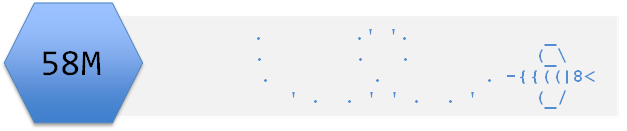

[](https://doi.org/10.5281/zenodo.5442490)

```{r setup, include=FALSE}
knitr::opts_chunk$set(echo = FALSE,
                      message = FALSE,
                      warning = FALSE)
```

```{r pkg}
library(RefManageR)
library(tidyverse)
library(Rtsne)
```

```{r, load-refs, include=FALSE, cache=FALSE}
BibOptions(check.entries = FALSE,
           bib.style = "authoryear",
           cite.style = "authoryear",
           style = "markdown",
           hyperlink = FALSE,
           dashed = FALSE,
           longnamesfirst = FALSE,
           max.names = 2)
myBib <- ReadBib("../refs.bib", check = FALSE)
```


# Week Overview

## Aim
The aim of this topic is to introduce you to machine learning in general to to some unsupervised methods in particular. In the next topic we will consider some supervised methods.

## Objectives
By the end of this week the successful student should be able to:

-  Describe what is meant by machine learning the primary way to classify ML methods
-  List a few supervised and unsupervised methods
-  to apply, visualise and interpret Principal Components Analysis and t-SNE

I suggest having a different RStudio Project for each dataset used. Note that you can have multiple instances of RStudio running to allow you to work on more than one RStudio Project.

Create directory structure for each RStudio Project, write your analysis in R Markdown with named chunks which are well organised.

# Task 1

The [Wheat Seeds Dataset](../data-raw/seeds_dataset.txt) contains measurements of seed kernels from different varieties of wheat: Kama (1), Rosa (2) and Canadian (3). High quality visualization of the internal kernel structure was detected using a soft X-ray technique and 7 measurements were taken which are in this order in the file:

-   Area.
-   Perimeter.
-   Compactness
-   Length of kernel.
-   Width of kernel.
-   Asymmetry coefficient.
-   Length of kernel groove.

Investigate whether these variables might be useful to classifiy the species.

```{r include=FALSE}
# import data note the file does not include column names
file <- "../data-raw/seeds_dataset.txt"
# create column names
cols <- c("area", 
          "perimeter",
          "compactness",
          "kernal_length",
          "kernel_width",
          "asymmetry_coef",
          "groove_length",
          "species")
# import data
seeds <- read_table(file, col_names = cols)

# The species is coded as 1, 2, and 3 and it would be useful to recode to the species names:
seeds$species <- recode(seeds$species,
                        `1` = "Kama",
                        `2` = "Rosa",
                        `3` = "Canadian")
```

```{r include=FALSE}
# If you have about 4 - 15 variables, plotting them pairwise against each other gives a nice overview. 
# This can be achieved with the `ggpairs()` from the `GGally` package.

seeds %>% 
  GGally::ggpairs(aes(color = species)) 

```

```{r include=FALSE}
# Principal Components Analysis (PCA) is method to investigate whether you have groups or patterns in a dataset. It is 'data reduction' or 'dimension reduction' method and creates a set of 'components' (axes) which are linear combinations of the original variables. 
# PCA is useful when relatively few components are needed to capture most of the variation in the data.
# **Scaling**: When the values in one variable are much bigger than in others we usually scale all the variable (mean of zero and a unit variance) before undertaking PCA to avoid the variable with the biggest values dominating the analysis.

pca <- seeds %>% 
  select(-species) %>% 
  prcomp(scale. = TRUE)

# To see the variance accounted for by each component
summary(pca)
# nearly 99% variation is captured in the first three components.

# To see the importance (loading) of each variable in each component
pca$rotation
# first component seems to be an axis of size, second of shape, third of density

# To plot, we might want to use the scores on each of the new axes and colour them by species. The scores are in a variable called $x
# For convenience, I'll put these in one 'tidy' dataframe
pca_labelled <- data.frame(pca$x, species = seeds$species)
# a then to do a scatterplot
ggplot(pca_labelled, aes(x = PC1, y = PC2, color = species)) +
  geom_point()

# t-SNE is a non-parametric, non-linear method that prioritises placing similar observations near each other.
# It is a probabilistic method and is computational intensive.

tsne <- seeds %>% 
  select(-species) %>%
  Rtsne(perplexity = 20,
        check_duplicates = FALSE)

dat <- data.frame(tsne$Y,  species = seeds$species)

dat %>% ggplot(aes(x = X1, y = X2, colour = species)) +
  geom_point()
```


# Task 2

Continue to work on the Case study of the proteomic data from five immortalised mesenchymal stromal cell (MSC) lines. That was covered here [Task 3 Topic 2](02_tidying_data.html#Task_3). So that you can focus on applying the methods from *this* week, a processed form of the data are in [sol.txt](../data-raw/sol.txt). Note that like the raw data file, these are organised with samples in columns and proteins in rows. In order use the genes as variables and the samples as observations, we will need to transpose the data.

Import:

```{r echo=TRUE}
file <- "../data-raw/sol.txt"
sol <- read_table(file)
names(sol)
```

We can see that the genename is in the first column.

Transpose all the values except the genename:

```{r echo=TRUE}
tsol <- sol %>% 
  select(-genename) %>% 
  t() %>% 
  data.frame()
```

Use the genenames in `sol` to name the columns in `tsol`:

```{r echo=TRUE}
names(tsol) <- sol$genename
```

The column names of `sol` have become the row names of `tsol`. We can add a column for these as well.

```{r echo=TRUE}
tsol$sample <- row.names(tsol)
```

And process the sample name so we have the cell lineage in one column and the replicate in another

```{r echo=TRUE}
tsol <- tsol %>% 
  extract(sample, 
          c("lineage","rep"),
          "(Y[0-9]{3,4})_([A-C])")
```

Now the data should be in a format to which you can apply the methods from this week.

```{r include=FALSE}
pca <- tsol %>% 
  select(-lineage, -rep) %>%
  prcomp(scale. = TRUE)

# To see the variance accounted for by each component
summary(pca)
# nearly 82% variation is captured in the first six components.

# looking at the loadings when there are very many variables - 861 in this case - is usually not that helpful
# To plot, we might want to use the scores on each of the new axes and colour them by species. The scores are in a variable called $x
# For convenience, I'll put these in one 'tidy' dataframe
pca_labelled <- data.frame(pca$x, lineage = tsol$lineage)
# a then to do a scatterplot
ggplot(pca_labelled, aes(x = PC1, y = PC2, color = lineage)) +
  geom_point()

# because there are very few observatios, perplexity must be very low
tsne <- tsol %>% 
  select(-lineage, -rep) %>%
  Rtsne(perplexity = 4,
        check_duplicates = FALSE)

dat <- data.frame(tsne$Y,  lineage = tsol$lineage)

dat %>% ggplot(aes(x = X1, y = X2, colour = lineage)) +
  geom_point()

# a consistent message of 101.5 being distinctly different is has emerged.
```

# Task 3

Start working with your own assessment. Do continue to follow the practice covered in previous workshops with respect to project organisation, coding style and reproducibility.

# The code files
These contain all the code needed in the workshop even where it is not visible on the webpage.
[Rmd file](05_intro_to_ML_unsupervised.Rmd) The Rmd file is the file I use to compile the practical. Rmd stands for R markdown. It allows R code and ordinary text to be interweaved to produce well-formatted reports including webpages. If you right-click on the link and choose Save-As, you will be able to open the Rmd file in RStudio. Alternatively, [View in Browser](https://github.com/3mmaRand/BIO00058M-Data-science-2020/blob/master/workshops/05_intro_to_ML_unsupervised.Rmd).


Pages made with `rmarkdown` `r Cite(myBib, c("markdown1","markdown2", "markdown3"))`, `RefManageR``r Cite(myBib, "RefManageR")` 


# References 

```{r refs, echo=FALSE, results="asis"}
PrintBibliography(myBib)  
```

# Please cite as:

Emma Rand. (2021). Data Science strand of BIO00058M (v1.0). Zenodo. https://doi.org/10.5281/zenodo.5442490


